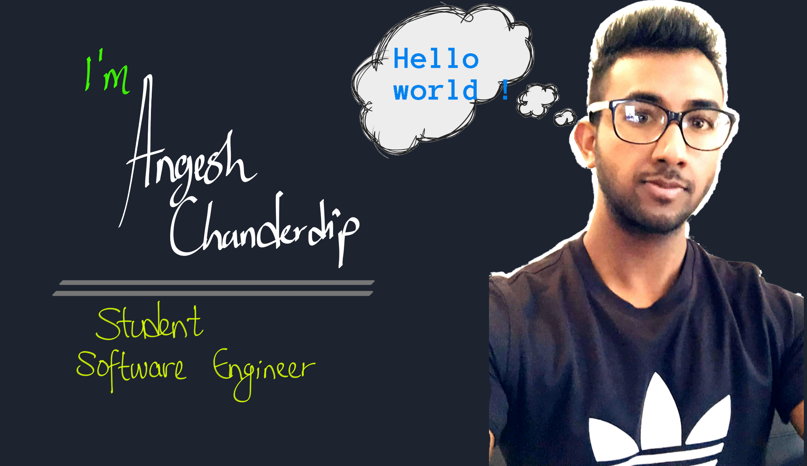

<h2></h2> 

  
<h3>Hello World!  
 My name is Angesh Chanderdip
 I'm a Student Software Engineer 
 3rd Year in Computer Science
</h3>

# About Me

<h4>A collaborative, ambitious and hard-working software developer student with a great passion for software programming. I am currently in my 3rd year of BSC in computer science at Technological University Dublin. I use my spare time to code small project and do online coding courses on Udemy.  </h4>

# Project
This Repo Contains all the projects I worked on

# Video Channel
Watch the final product of the following projects:

BugZap - https://youtu.be/XkqoX-LaiKw

E-Library - https://youtu.be/jONxI65WpsA
